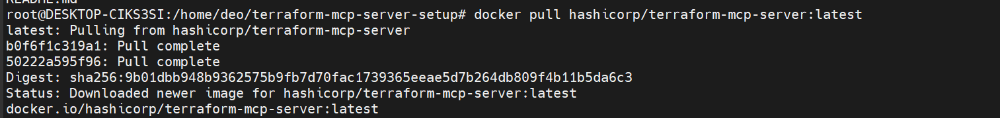
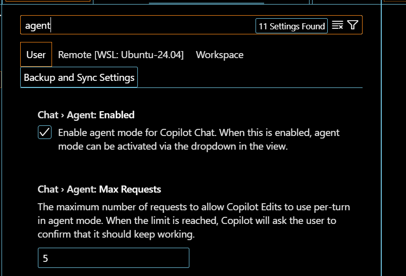
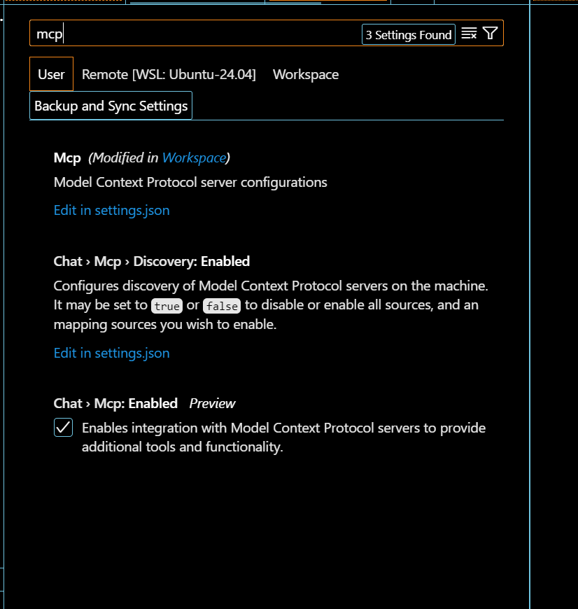
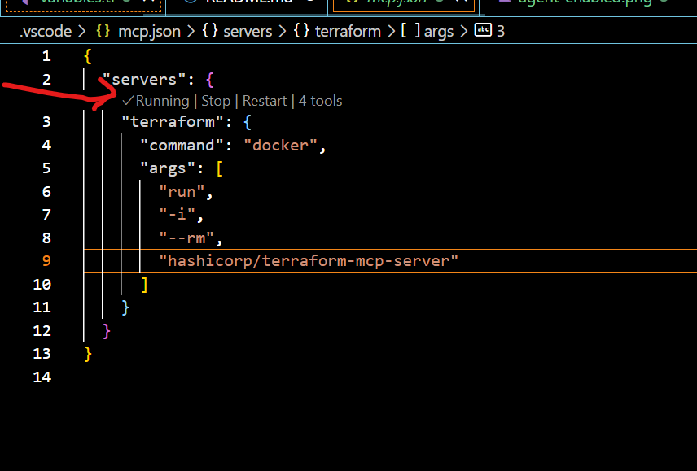
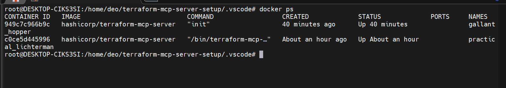
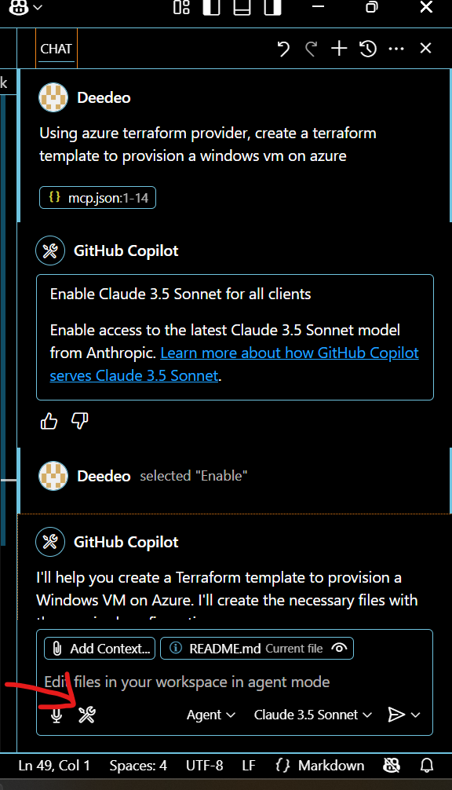
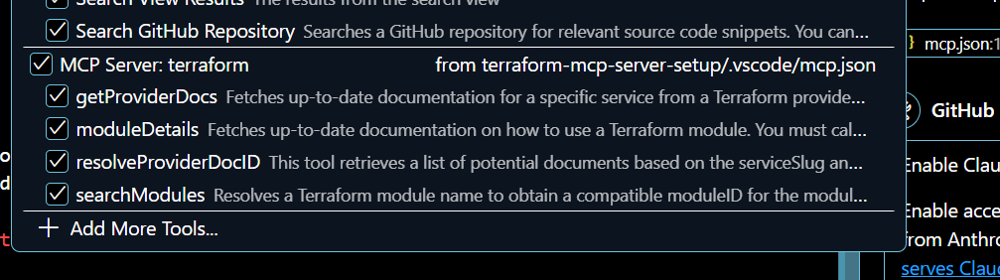
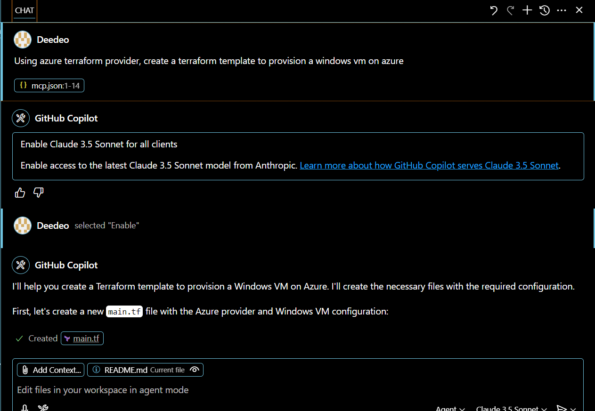

# Getting Started with Terraform MCP Server Using GitHub Copilot

This guide will help you set up and use the Terraform Model Context Protocol (MCP) server with GitHub Copilot.

## Table of Contents
1. [Prerequisites](#prerequisites)
2. [Installation Steps](#installation-steps)
3. [Configuration](#configuration)
4. [Verification](#verification)
5. [Usage](#usage)

## Prerequisites

Before you begin, ensure you have the following installed:

1. **Windows Subsystem for Linux (WSL)**
   - Required for running Linux-based containers on Windows
   - [Official WSL Installation Guide](https://docs.microsoft.com/en-us/windows/wsl/install)

2. **Docker Desktop**
   - Required for running the Terraform MCP server container
   - [Download Docker Desktop](https://www.docker.com/products/docker-desktop)

3. **Visual Studio Code**
   - With the following extensions installed:
     - GitHub Copilot
     - GitHub Copilot Chat
     - Model Context Protocol (MCP)

## Installation Steps

1. **Pull the Terraform MCP Server Image**
   ```bash
   docker pull hashicorp/terraform-mcp-server
   ```
   

2. **Enable GitHub Copilot and MCP**
   - Open VS Code Settings
   - Verify GitHub Copilot is activated
   - Enable MCP extension
   
   
   

## Configuration

1. **Create MCP Configuration File**
   - Create a new file at `.vscode/mcp.json` in your project root
   - Add the following configuration:
   ```json
   {
     "servers": {
       "terraform": {
         "command": "docker",
         "args": [
           "run",
           "-i",
           "--rm",
           "hashicorp/terraform-mcp-server"
         ]
       }
     }
   }
   ```

   > **Note**: This configuration activates MCP specifically for this project. For other use cases, refer to the [official Terraform MCP documentation](https://developer.hashicorp.com/terraform/docs/tools/mcp-server).

## Verification

1. **Start the MCP Server**
   - Look for the start icon in VS Code
   

2. **Verify Docker Container**
   - Run the following command to check if the Terraform MCP container is running:
   ```bash
   docker ps
   ```
   

3. **Check Available Functions**
   - Click the tools icon in the GitHub Copilot chat section
   
   - You should see the list of available Terraform MCP functions
   

## Usage

When using GitHub Copilot with the Terraform MCP server:

1. **Writing Prompts**
   - Be specific in your requirements
   - Include relevant details about providers and resources
   - Example prompt:
     ```
     Using azure terraform provider, create a terraform template to provision a windows vm on azure
     ```
   

2. **Best Practices**
   - Always specify the provider you want to use
   - Include resource requirements clearly
   - Review and validate generated configurations
   - Test in a non-production environment first

## Additional Resources

- [Terraform Documentation](https://www.terraform.io/docs)
- [Azure Provider Documentation](https://registry.terraform.io/providers/hashicorp/azurerm/latest/docs)
- [GitHub Copilot Documentation](https://docs.github.com/en/copilot)


